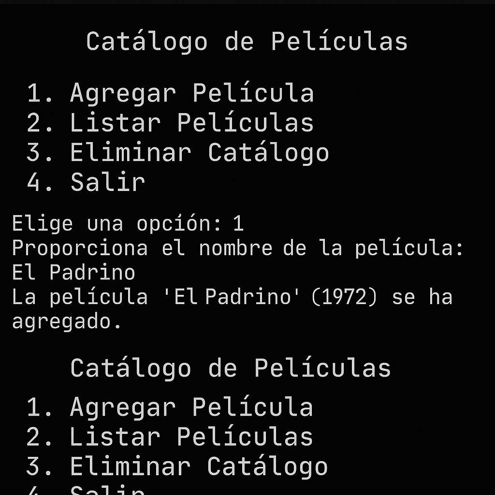

# 🎬 Catálogo de Películas Argentinas

Este es un programa interactivo en Python que te permite gestionar un catálogo de películas nacionales.

## 📁 Archivos incluidos

- `menupelis.py`: archivo principal con el menú y las opciones.
- `pelicula.py`: contiene la clase `Pelicula` y `CatalogoPeliculas`.
- `A_screenshot_of_a_command-line_interface_window_sh.png`: captura simulada del programa funcionando.

## 🚀 ¿Qué podés hacer?

- Agregar nuevas películas al catálogo.
- Ver todas las películas listadas.
- Buscar películas por nombre.
- Eliminar el catálogo.

## ▶️ Cómo ejecutarlo

1. Asegurate de tener Python instalado.
2. Abrí la terminal en la carpeta donde están los archivos.
3. Ejecutá:

```bash
python menupelis.py
```

## 💡 Requisitos

- Python 3
- El archivo `pelicula.py` debe estar en la misma carpeta que `menupelis.py`.

## 🖼️ Ejemplo del menú funcionando



## 👤 Creado por PB